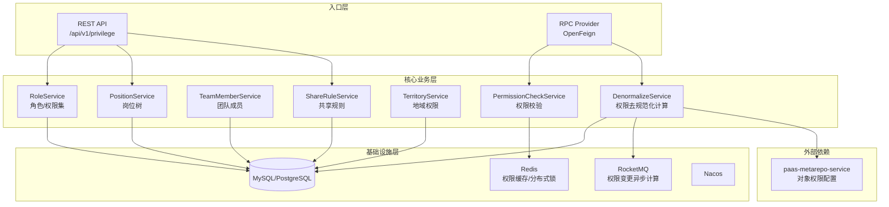
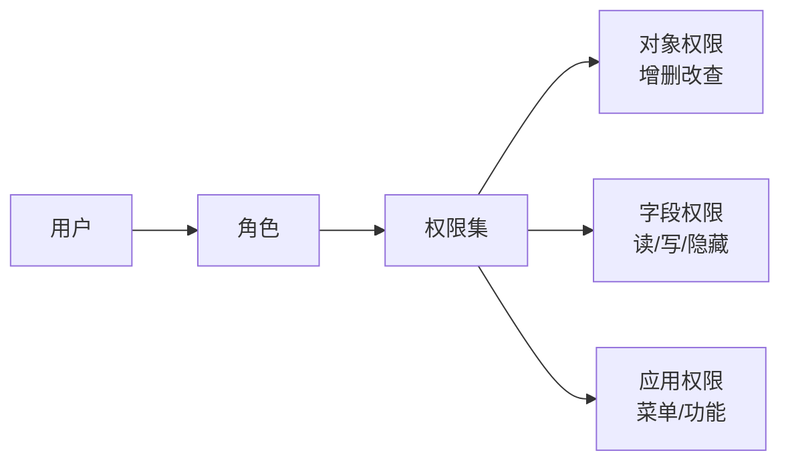
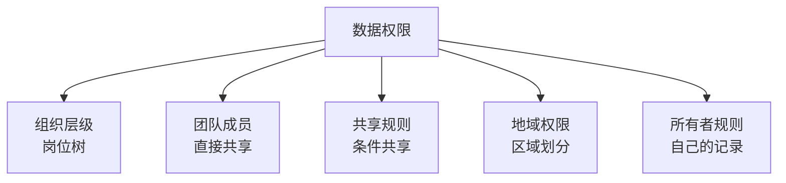
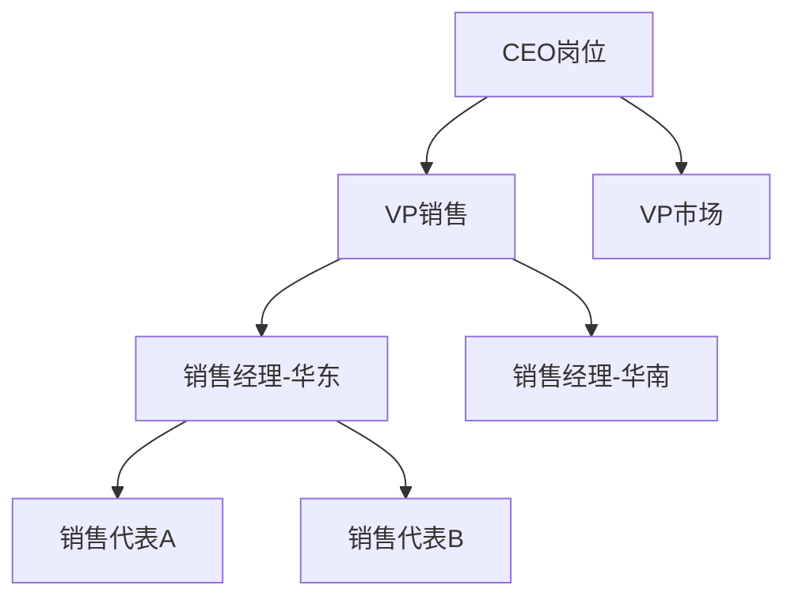
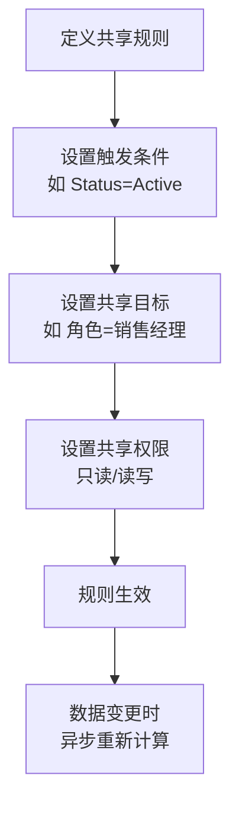
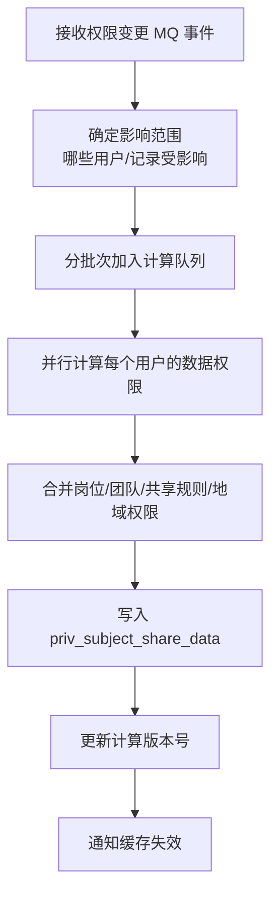
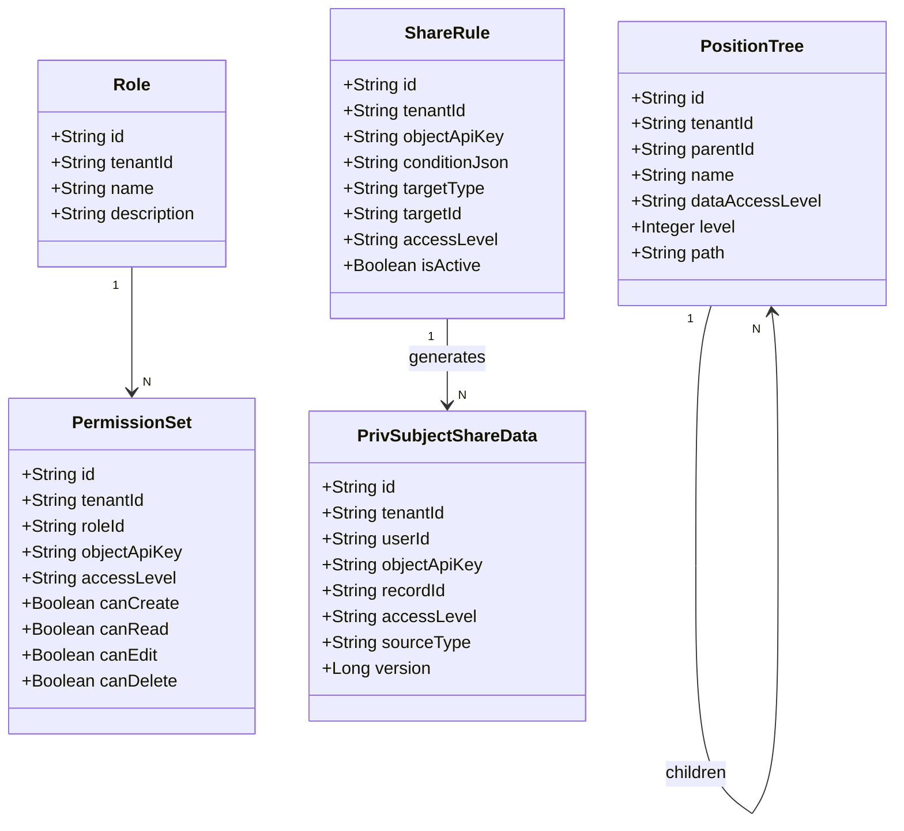
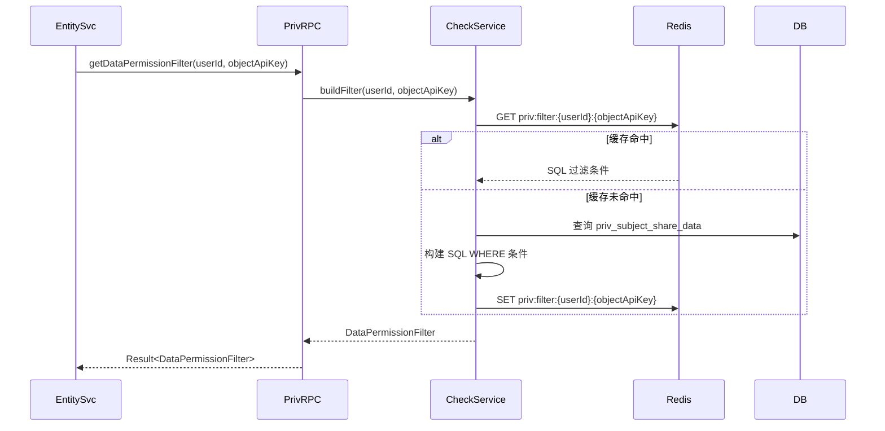
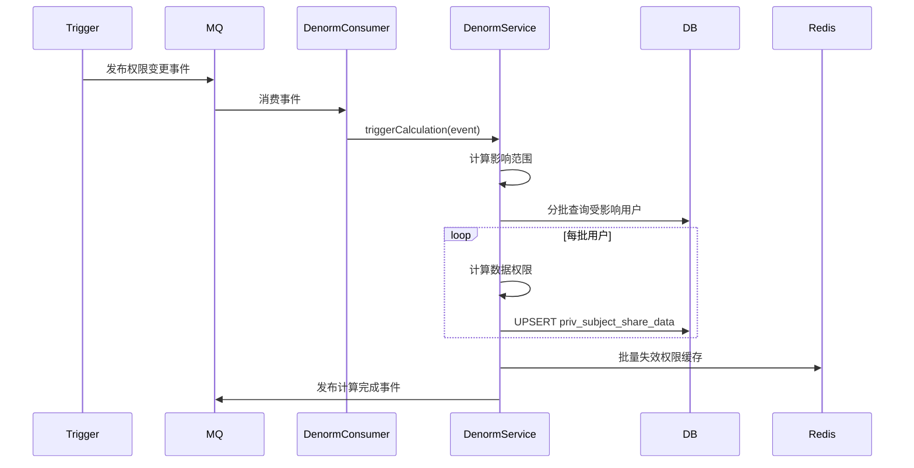

# paas-privilege-service 技术设计方案

## 1. 服务概述

权限服务，负责 aPaaS 平台的全量权限体系。包含功能权限（角色/权限集）和数据权限（共享规则/岗位/团队/地域）两大体系。其他服务通过 RPC 调用本服务进行权限校验和数据权限过滤条件获取。

---

## 2. 系统架构



---

## 3. 权限体系设计

### 3.1 功能权限体系



**对象权限级别（ObjectAccess）：**

| 级别 | 说明 |
|---|---|
| NONE | 无权限 |
| READ | 只读（受数据权限约束） |
| CREATE | 可创建 |
| EDIT | 可编辑（受数据权限约束） |
| DELETE | 可删除（受数据权限约束） |
| ALL | 全部权限 |

### 3.2 数据权限体系

数据权限决定用户能看到哪些记录，通过以下维度叠加计算：



**数据权限计算结果（去规范化）：**
- 将用户能访问的所有记录 ID 预计算并存储到 `priv_subject_share_data` 表
- 查询时直接 JOIN 该表，避免实时计算
- 权限变更时异步重新计算（MQ 驱动）

---

## 4. 模块职责

### 4.1 RoleService（角色/权限集）

| 方法 | 说明 |
|---|---|
| `createRole` | 创建角色，关联权限集 |
| `assignRole` | 为用户分配角色 |
| `getObjectPermission` | 查询用户对某对象的功能权限 |
| `getFieldPermission` | 查询用户对某字段的权限 |
| `checkPermission` | 校验用户是否有某操作权限 |

### 4.2 PositionService（岗位树）

管理企业组织架构的岗位层级，用于数据权限的上下级可见性控制。



**岗位数据权限规则：**
- `PRIVATE`：只能看自己的记录
- `PUBLIC_READ`：可以看下级的记录（只读）
- `PUBLIC_READ_WRITE`：可以看并编辑下级的记录
- `PUBLIC_FULL`：可以看并完全控制下级的记录

### 4.3 TeamMemberService（团队成员）

支持将记录直接共享给特定用户或用户组。

- 记录级别的精细化共享
- 支持共享给用户、角色、公共组
- 共享权限可设置为只读或读写

### 4.4 ShareRuleService（共享规则）

基于条件的自动共享规则，满足条件的记录自动共享给指定用户群体。



### 4.5 DenormalizeService（权限去规范化计算）

核心计算引擎，将复杂的权限规则预计算为扁平的数据权限表。

**计算触发时机：**
- 用户角色变更
- 岗位层级变更
- 共享规则变更
- 团队成员变更
- 记录所有者变更

**计算流程：**


### 4.6 PermissionCheckService（权限校验）

提供给其他服务调用的权限校验接口。

- 功能权限校验：用户是否有某对象的某操作权限
- 数据权限过滤：返回 SQL WHERE 条件，供 entity-service 拼接查询

---

## 5. 数据模型



---

## 6. 核心流程

### 6.1 数据权限过滤流程



**DataPermissionFilter 结构：**
```json
{
  "type": "RECORD_IDS | ALL | NONE",
  "recordIds": ["id1", "id2"],
  "sqlCondition": "owner_id = 'xxx' OR id IN (SELECT record_id FROM priv_share WHERE user_id = 'xxx')"
}
```

### 6.2 权限去规范化异步计算



---

## 7. 接口设计

### 7.1 REST 接口

| 方法 | 路径 | 说明 |
|---|---|---|
| POST | `/api/v1/roles` | 创建角色 |
| POST | `/api/v1/roles/{id}/assign` | 分配角色给用户 |
| GET | `/api/v1/permissions/check` | 功能权限校验 |
| POST | `/api/v1/share-rules` | 创建共享规则 |
| GET | `/api/v1/position-tree` | 查询岗位树 |
| POST | `/api/v1/team-members` | 添加团队成员 |
| POST | `/api/v1/repair/recalculate` | 手动触发权限重算（运维） |

### 7.2 RPC 接口（core module）

```java
@FeignClient(name = "paas-privilege-service")
public interface PrivilegeApi {
    // 功能权限校验
    Result<Boolean> checkObjectPermission(String tenantId, String userId,
                                          String objectApiKey, String operation);

    // 获取数据权限过滤条件
    Result<DataPermissionFilter> getDataPermissionFilter(String tenantId,
                                                          String userId,
                                                          String objectApiKey);

    // 批量校验字段权限
    Result<Map<String, String>> getFieldPermissions(String tenantId,
                                                     String userId,
                                                     String objectApiKey);
}
```

---

## 8. 缓存策略

| 缓存 Key | 内容 | TTL | 失效时机 |
|---|---|---|---|
| `priv:func:{userId}:{objectApiKey}` | 功能权限 | 10min | 角色变更 |
| `priv:filter:{userId}:{objectApiKey}` | 数据权限过滤条件 | 5min | 权限重算完成 |
| `priv:field:{userId}:{objectApiKey}` | 字段权限 | 10min | 角色变更 |

---

## 9. 异常处理

| 异常场景 | 处理策略 |
|---|---|
| 权限计算超时 | 降级返回最保守权限（只读自己的记录） |
| MQ 消费失败 | 重试5次，失败写死信队列，告警人工处理 |
| 权限数据不一致 | 提供 `/repair/recalculate` 接口手动触发重算 |
| 循环岗位依赖 | 创建岗位时检测环路，拒绝操作 |


---

## 10. 数据存储说明

privilege-service **不直接维护独立的业务数据库表**。权限相关的元数据定义（角色、权限集、岗位、共享规则等）存储在 `paas-metarepo-service` 的 `xsy_metarepo` schema 中，通过 metarepo 的 RPC 接口读写。运行时权限计算结果（去规范化数据）存储在 Redis 缓存中，不持久化到独立 DB。

<!-- DDL 章节已移除，privilege-service 无独立数据库表 -->
